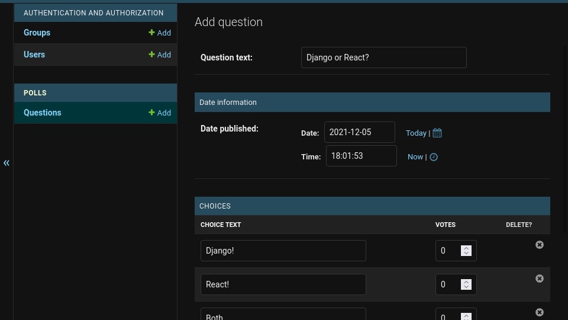
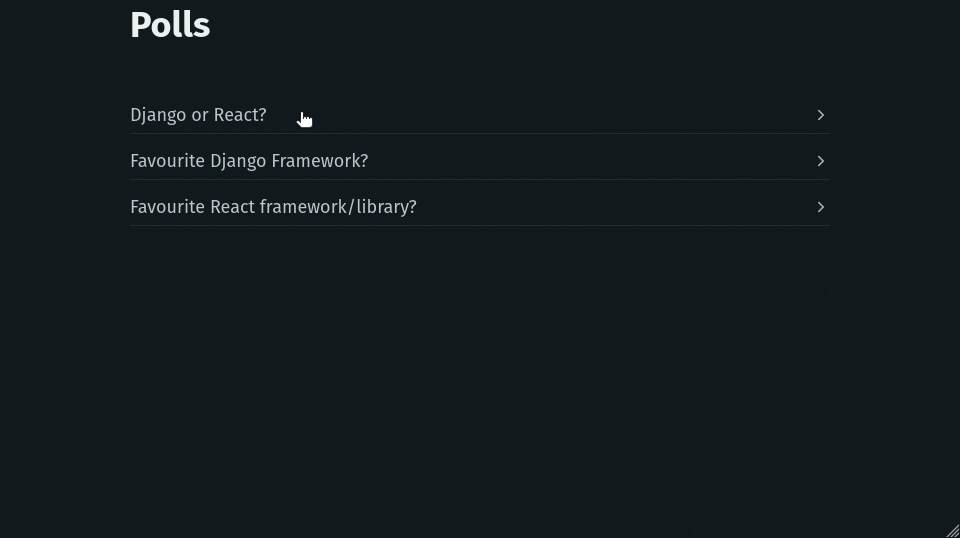

# Building a web application using Django and React


## Preamble

This guide will demonstrate how to create a web application using Django and React where users can vote on polls.

I wrote this guide to reflect how web apps are built in 2021 where we use such tools to rapidly prototype and deploy applications and to put new developers in a position where they can leverage such technologies effectively.

[Django](https://www.djangoproject.com) accelerates the development of web applications providing a solid backend foundation.

[React](https://reactjs.org/) simplifies the creation of user interfaces and frontend applications.

Our application will use the Django REST framework (DRF) to provide a backend API which our frontend React app will consume to provide a web interface.

There are many advantages in keeping the frontend and backend decoupled. The project is more maintainable and easier for frontend and backend teams to work on independently while also reducing server costs (because the frontend is static) and increasing page load speeds through CDNs.

You can clone the completed application from [GitHub](https://github.com/ykeyani/django-react-guide) and download this document as a [pdf](https://github.com/ykeyani/django-react-guide/blob/8d7fbd04f3e676e66b506b700488b75a5691ea6b/building-a-web-application-using-django-and-react.pdf).

### Who is this for?
The reader should have a basic understanding of [python](https://docs.python.org/3/) and [javascript](https://developer.mozilla.org/en-US/docs/Web/JavaScript).

Some of the concepts will be easier to grasp if the following tutorials have already been completed.

- [Django/Getting started](https://docs.djangoproject.com/en/3.2/intro/)
- [Django REST framework/quickstart](https://www.django-rest-framework.org/tutorial/quickstart/)
- [React/Tutorial: Intro to React](https://reactjs.org/tutorial/tutorial.html)

While I'll endeavour to explain each part as fully as possible the reader should consult the relevant docs when confused.

<mark>This project is designed for learning purposes and should not be used in production.</mark>

### Requirements
- Python 3.6+ available
- venv supported (may require system package)
- npm and npx commands available
- git command avilable
- linux/macOS

## Getting Started

We'll start by making a project folder and setting up the git repository. Remember that lines starting with `$` indicates a normal user shell command where for example `$ ls` means you should type `ls` into the shell. Comments will start with `#` and provide additional help or context as to what you are doing.

We will create a project folder under `~/Projects/django-react-guide` and I would advise the reader to use the same location to avoid confusion later on.
```bash
# Create the project folder and cd into it.
$ mkdir -p ~/Projects/django-react-guide && cd ~/Projects/django-react-guide
# Add a readme and GPLv3 license.
$ echo "# Django + React" > README.md && curl "https://www.gnu.org/licenses/gpl-3.0.md" -o LICENSE.md
```

We will now setup our git repository to allow version control and act as a way to to test changes without losing existing work while also allowing us to rollback to a previous version of our code.

```bash
# Initialize the projects' git repository.
$ git init
# Make git track all the files in this directory and stage them for the following "commit".
$ git add .
# A commit will save the current state of staged files and allow us to compare changes
# and roll back to an earlier commit should we need to.
$ git commit -m "init"
```

## API

In this section we will create our backend API which will be responsible for managing our data and providing API "endpoints" which are URLs that will respond to HTTP methods like `GET` and `POST` acting on or returning data.

### Setup

Lets start by creating a project folder for our API and adding a `.gitignore` file that will tell git to ignore certain files and directories that are either private or should be regenerated on a developers computer.

```bash
# Return to the project root (if you moved away).
$ cd ~/Projects/django-react-guide/
# Create the Django API project folder.
$ mkdir ./api && cd ./api
# Fetch a generic python .gitignore using  curl
$ curl "https://raw.githubusercontent.com/github/gitignore/master/Python.gitignore" -o ./.gitignore
```

The python virtual environment `venv` module creates a lightweight environment with its own site directories isolated from the systems python directories allowing us to tailor our python interpreter and dependencies to our current project ([venv documentation](https://docs.python.org/3/library/venv.html)).

We will create a virtual environment (venv) now, it will be excluded from our git repo thanks to the `.gitignore` we added earlier (we really don't want it cluttering our repo).

We will also create a `requirements.txt` file that we will use with the `pip` command to install our project dependencies into our venv.

Below you will notice that `(venv)$` denotes we are within our virtual environment which can be exited using the  <kbd>Ctrl</kbd> + <kbd>D</kbd> shortcut or by typing `exit` into the shell.

```bash
# Ensure we are within our Django api directory.
$ cd ~/Projects/django-react-guide/api/
# Create a venv.
$ python3 -m venv --upgrade-deps ./venv
# Create a requirements file which lists the python packages we need.
# Namely: django, djangorestframework and django-cors-headers.
$ echo $'django\ndjangorestframework\ndjango-cors-headers' > ./requirements.txt
# We will now activate this venv using the source command.
# We will need to be within this environment when interacting with our Django project.
$ source ./venv/bin/activate
# Install the requirements file using pip.
(venv)$ pip install -r ./requirements.txt
```

After pip installs the `django` package our venv will now provide the `django-admin` command which we will use to create an empty project. Note that within our venv, the `python` command will point to our virtual environment and not our system python installation, rest assured that it will be the same as the systems `python3` .

 `django-admin startproject [project name] [location]` will create the correct folder structure and project files to quickly begin developing with Django.

```bash
# Ensure we are within our Django api directory.
$ cd ~/Projects/django-react-guide/api/
# Create a fresh django project in the current directory.
(venv)$ django-admin startproject api .
# Commit the projects initial state.
(venv)$ git add .
(venv)$ git commit -m "vanilla django project"
```

Once the project has been created it will provide us with a `manage.py` script that automates a lot of tasks.

The `makemigrations` command will generate SQL for our data models within migration files which are just python files that you can modify as needed ([migration files](https://docs.djangoproject.com/en/3.2/topics/migrations/#migration-files)). We can `makemigrations` whenever our models change to help us migrate our data easily.

The `migrate` command will cause the current migrations to be applied to the database creating tables as needed or altering them when we alter our models.

For this learning project we will use the default sqlite database driver but for production you will want to install and configure a real database like postgresql, see [the docs](https://docs.djangoproject.com/en/3.2/ref/databases/) for more details.

```bash
# Migrate the database
(venv)$ python manage.py migrate
```

We will also want to create an admin superuser for later use, the superuser is an account with maximum permissions and should generally not be used for normal administrative actions, see [the docs](https://docs.djangoproject.com/en/3.2/topics/auth/default/#permissions-and-authorization) for more details.

```bash
# Create an admin superuser that we can use later
(venv)$ python manage.py createsuperuser
```

Finally we will create an app which will contain our polls API using the `manage.py` script which will create all the necessary cruft for our app to work with the framework.
```bash
(venv)$ python manage.py startapp polls
```

### Data Model

In Django we interact with our database using `Model` subclasses that allow SQL migrations to be automatically created and an ORM interface to be used when interacting with our database tables. Generally each `Model` represents a database table, see [the docs](https://docs.djangoproject.com/en/3.2/topics/db/models/) for more information.

Our app will use two models to represent a poll that users can vote on, you will probably recognize them from the [Django tutorial](https://docs.djangoproject.com/en/3.2/intro/tutorial01/).

A `Question` model will contain the poll question in a `CharField` called `question_text` , the `CharField` will represent a field for character types in the database table.

A `Choice` model will represent the choices that can be voted for and will be related to a `Question` instance using a `ForeignKey` field called `question` . Votes will be stored in the `votes` field.

While I've kept things simple, if you're new to Django you might want to read a little more about [Models](https://docs.djangoproject.com/en/3.2/topics/db/models/).

<u>*api/polls/models.py*</u>
```python
from django.db import models


class Question(models.Model):
    question_text = models.CharField(max_length=200)
    pub_date = models.DateTimeField('date published')

    def __str__(self):
        return self.question_text


class Choice(models.Model):
    question = models.ForeignKey(Question, related_name='choices', on_delete=models.CASCADE)
    choice_text = models.CharField(max_length=200)
    votes = models.IntegerField(default=0)

    def __str__(self):
        return self.choice_text

```

### Admin

Django provides an admin interface that automatically creates a UI for interacting with our models allowing us to search for data and create/edit instances of a model with an automatically generated form ([admin docs](https://docs.djangoproject.com/en/3.2/ref/contrib/admin/)).

These forms are created through the use of special admin classes that do a lot of work behind the scenes to create interfaces for us.

The `QuestionAdmin` will inherit `ModelAdmin` and will represent our `Question` model within the admin interface. `ChoiceInline` will represent our `Choice` model and be contained within the `QuestionAdmin` interface as a `Choice` should always have a parent `Question`.

Our `QuestionAdmin` will set the following properties:

- `fieldsets` to control how a `Question` is displayed.
- `inlines` to specify that `ChoiceInline` should be included in the interface and automatically link each `Choice` instance with this `Question` .
- `list_display` to specify which table fields should be shown in the list view where we can see all of our `Question` instances (table rows).
- `list_filter` to allow us to filter by the `pub_date` field.
- `search_fields` to allow us to search `Question` instances by `question_text`.

Our `ChoiceInline` simply specifies which `model` to use and how many `extra` empty rows to display when adding choices to a `Question` .

Finally we will register the `QuestionAdmin` with the admin site as the interface to use for `Question`.

This will make more sense once you explore the admin interface for yourself and play around with the settings.

<u>*api/polls/admin.py*</u>
```python
from django.contrib import admin

from .models import Question, Choice


class ChoiceInline(admin.TabularInline):
    model = Choice
    extra = 3


class QuestionAdmin(admin.ModelAdmin):
    fieldsets = [
        (None, {'fields': ['question_text']}),
        ('Date information', {'fields': ['pub_date']}),
    ]

    inlines = (ChoiceInline,)

    list_display = ('question_text', 'pub_date')
    list_filter = ['pub_date']
    search_fields = ['question_text']


admin.site.register(Question, QuestionAdmin)

```

### Serializers

Our serializers are responsible for converting data from our database into the JSON our frontend application will use while also validating and deserializing votes our users submit ([serializers docs](https://www.django-rest-framework.org/api-guide/serializers/)).

A `ModelSerializer` will automatically allow serialization/deserialization and validation for `Model` data. An internal `Meta` class controls which `model` and `fields`  it should serialize allowing us to for example exclude fields that aren't necessary for frontend applications to know about.

As our `QuestionSerializer` and `ChoiceSerializer` will map closely to our models we can inherit from `ModelSerializer` to automatically generate all the required fields. We specify `ChoiceSerializer` for the `choices` field in our `QuestionSerializer` so that field is serialized using our `ChoiceSerializer` , in this way we have a lot of control in how each field will be represented.

`VoteSerializer` is different because it's only purpose is to validate user votes and save them to the database so we inherit from `Serializer` which is more suited for data that doesn't map closely to our actual models. By using `PrimaryKeyRelatedField` for its `choice` field, user submitted choices will be validated against the `Choice` model based on the primary key.

The `create` function within `VoteSerializer` will be called when the serializer is saved and will simply increment the `votes` count for the relevant `Choice` instance using an *F() expression* which you can read more about [here](https://docs.djangoproject.com/en/3.2/ref/models/expressions/#f-expressions) but simply put, it tells the database to do the increment to prevent a race condition where votes would be lost.

The `update` function will not be used and we declare that by raising a `NotImplementedError` as a way of [*self documenting*](https://en.wikipedia.org/wiki/Self-documenting_code) the code.

<u>*api/polls/serializers.py*</u>
```python
from django.db.models import F
from rest_framework import serializers
from rest_framework.serializers import PrimaryKeyRelatedField

from .models import Question, Choice


class ChoiceSerializer(serializers.ModelSerializer):
    class Meta:
        model = Choice
        fields = ('id', 'choice_text', 'votes')


class QuestionSerializer(serializers.ModelSerializer):
    choices = ChoiceSerializer(many=True)

    class Meta:
        model = Question
        fields = ('id', 'question_text', 'pub_date', 'choices')


class VoteSerializer(serializers.Serializer):
    choice = PrimaryKeyRelatedField(many=False, queryset=Choice.objects.all())

    def create(self, validated_data):
        choice_instance = validated_data.pop('choice')
        choice_instance.votes = F('votes') + 1
        choice_instance.save()
        return Choice.objects.get(pk=choice_instance.pk)

    def update(self, instance, validated_data):
        raise NotImplementedError()

```

### Views

In Django views handle a web request and generate a response like the HTML of a webpage or a HTTP status code like 404. They could be a function or a class ([view docs](https://docs.djangoproject.com/en/3.2/topics/http/views/)).

When using DRF, views act as API endpoints where they will return serialized data (in our case JSON), a `ViewSet` combines multiple related views into a single class where we define a `list` method to return a listing of serialized data or a `retrieve` method to return a single instance. It also allows for routers (to be introduced later) to generate a logical set of URLs for us where a URL like `/api/polls/` would return a list of all polls and a URL like `/api/polls/1` would return a single poll with a `pk` equal to 1 ([viewset docs](https://www.django-rest-framework.org/api-guide/viewsets/)).

Our `PollView` will inherit from `ModelViewSet` which provides all the functionality required to interact with our `Question` model with `list` ,  `retrieve` ,  `create` ,  `update` ,  `partial_update` and `destroy` methods that are self explanatory.

We extend this functionality by adding a `vote` method and marking it as another action with the `@action` decorator, by default the router will give this a relative URL of `vote/` so if `PollView` has the URL of `/api/polls/` this action will be used from `/api/polls/vote/` .

The `vote` action uses the `VoteSerializer` to cast a vote, the `VoteSerializer` will expect to receive some serialized data like `{choice: 1}` and will then return the `Choice` instance that was changed which will then be serialized and returned in a `Response` , we would expect a `ValidationError` if the received data is invalid, but `Choice.DoesNotExist` is unlikely to be raised as in most cases will be handled within the serializers validation logic but it's always good to identify all expected exceptions and handle them quickly and gracefully to prevent unnecessary `500` response codes.

It's also worth noting that we specify a `serializer_class` in the `@action` decorator which makes `self.get_serializer` return the correct serializer and the correct form to be shown within the browsable API. We set `permission_classes=[AllowAny]` because we want to allow anyone to vote on the poll, if this was "production" ready we would want to do additional checks to prevent people voting multiple times.

<u>*api/polls/views.py*</u>
```python
from rest_framework import viewsets, status
from rest_framework.decorators import action
from rest_framework.permissions import AllowAny
from rest_framework.response import Response
from rest_framework.serializers import ValidationError

from .models import Question, Choice
from .serializers import QuestionSerializer, ChoiceSerializer, VoteSerializer


class PollView(viewsets.ModelViewSet):
    serializer_class = QuestionSerializer
    queryset = Question.objects.all()

    @action(methods=['post'], detail=False, permission_classes=[AllowAny], serializer_class=VoteSerializer)
    def vote(self, request):
        try:
            vote_serializer = self.get_serializer(data=request.data)
            vote_serializer.is_valid(raise_exception=True)
            choice = vote_serializer.save()
            choice_serializer = ChoiceSerializer(choice)
            return Response(choice_serializer.data, status=status.HTTP_200_OK)
        except Choice.DoesNotExist:
            return Response(status=status.HTTP_404_NOT_FOUND)
        except ValidationError as exp:
            return Response(exp.detail, status=exp.status_code)

```

### URLs

We define our URL patterns in a `urls.py` file that will dispatch requests to the correct view ([urls docs](https://docs.djangoproject.com/en/3.2/topics/http/urls/)).

DRF allows us to use routers that work with viewsets to generate URLs automatically ([router docs](https://www.django-rest-framework.org/api-guide/routers/)).

Because of the way we have organised our API we can simply register the `PollView` with a `DefaultRouter` and include that in our `urlpatterns` .

<u>*api/api/urls.py*</u>
```python
from django.contrib import admin
from django.urls import path, include
from rest_framework import routers

from polls import views

router = routers.DefaultRouter()
router.register('polls', views.PollView, 'poll')

urlpatterns = [
    path('admin/', admin.site.urls),
    path('api/', include(router.urls))
]

```

### Settings

We need to add our app and frameworks to `INSTALLED_APPS` .

<u>*api/api/settings.py*</u>
```python
INSTALLED_APPS = [
    'django.contrib.admin',
    'django.contrib.auth',
    'django.contrib.contenttypes',
    'django.contrib.sessions',
    'django.contrib.messages',
    'django.contrib.staticfiles',
	
	# add our app and required frameworks
    'corsheaders',
    'rest_framework',
    'polls',
]
```

We will add an entry to `MIDDLEWARE` so our CORS settings will work as expected.

<u>*api/api/settings.py*</u>
```python
MIDDLEWARE = [
    'django.middleware.security.SecurityMiddleware',
    'django.contrib.sessions.middleware.SessionMiddleware',
    'django.middleware.common.CommonMiddleware',
    'django.middleware.csrf.CsrfViewMiddleware',
    'django.contrib.auth.middleware.AuthenticationMiddleware',
    'django.contrib.messages.middleware.MessageMiddleware',
    'django.middleware.clickjacking.XFrameOptionsMiddleware',
	
	# add CORS middleware
    'corsheaders.middleware.CorsMiddleware'
]
```

We will whitelist `http://localhost:3000` which will host our react app later and set DRFs default permission class which will prevent public changes to our polls API by adding the following settings to the end of the file.

<u>*api/api/settings.py*</u>
```python

# CORS

if DEBUG:
    CORS_ORIGIN_WHITELIST = [
        'http://localhost:3000'
    ]

# REST FRAMEWORK

REST_FRAMEWORK = {
    'DEFAULT_PERMISSION_CLASSES': [
        'rest_framework.permissions.IsAuthenticatedOrReadOnly',
    ]
}

```

We should now make and apply migrations.

```bash
(venv)$ python manage.py makemigrations polls
(venv)$ python manage.py migrate
```

And create a new commit of our finished API.

```bash
(venv)$ git add .
(venv)$ git commit -m "API endpoints"
```

### Data

We can now start using the admin interface to populate our app with data.


The `manage.py` script provides a development server that we can use to test our application and access the admin site.

```bash
(venv)$ python manage.py runserver
```

We can now navigate to `http://localhost:8000/admin/` to view the admin interface, since it's our first time visiting we will need to login using the details we set when we ran the `createsuperuser` command earlier.


Once logged in we will see the admin interface showing all the installed apps that are registered with the admin site.


We registered the `Question` model with the admin site earlier, so it's displayed in the interface. The `Choice` model isn't shown because it was set to be *inline* within the `Question` model and so is contained within its admin interface.

You can select "Questions" to view a listing of question or choose to "Add" or "Change" a question, for now let's "Add" a new question.


Write out a question for "Question text", select a date and then add choices. Hit "Save" at the bottom of the page to add it to the database.



We will now be greeted with a listing of questions that we can search and filter by date, although there's only the one we saved so far.


Continue to add Questions and remember we are not limited to just three Choices, hit "Add another Choice" to add another row of choices and hit the delete icon to remove one.


We should now have a nice set of questions that our frontend app will be able to consume.


## Frontend

We can now move on to creating the frontend in react.

### Setup

An empty react app will be created under `web-frontend/` . The "web" prefix is used to maintain a logical naming convention as in the future frontends for other platforms might be created.

```bash
$ cd ~/Projects/django-react-guide
$ npx create-react-app web-frontend
$ cd ./web-frontend
```

We will also commit the fresh project.

```bash
$ git add .
$ git commit -m "vanilla react project"
```

We will only add a single CSS framework to the project to keep things simple.

```bash
$ npm install @picocss/pico
```

We'll also add a proxy setting `"proxy": "http://localhost:8000"` which will proxy unknown requests to our Django development server so that a request to a URL like `/api/polls/` will be proxied to `http://localhost:8000/api/polls/`.

You won't need to change any other settings and the file below is only provided for context. In other words simply add the `"proxy"` setting and leave the rest of the file unchanged.

<u>*web-frontend/package.json*</u>
```json
{
  "name": "web-frontend",
  "version": "0.1.0",
  "private": true,
  "proxy": "http://localhost:8000",
  "dependencies": {
    "@picocss/pico": "^1.4.1",
    "@testing-library/jest-dom": "^5.15.1",
    "@testing-library/react": "^11.2.7",
    "@testing-library/user-event": "^12.8.3",
    "react": "^17.0.2",
    "react-dom": "^17.0.2",
    "react-scripts": "4.0.3",
    "web-vitals": "^1.1.2"
  },
  "scripts": {
    "start": "react-scripts start",
    "build": "react-scripts build",
    "test": "react-scripts test",
    "eject": "react-scripts eject"
  },
  "eslintConfig": {
    "extends": [
      "react-app",
      "react-app/jest"
    ]
  },
  "browserslist": {
    "production": [
      ">0.2%",
      "not dead",
      "not op_mini all"
    ],
    "development": [
      "last 1 chrome version",
      "last 1 firefox version",
      "last 1 safari version"
    ]
  }
}

```

We will remove some of the extra files that `create-react-app` created as they are irrelevant to this guide.

```bash
$ cd ~/Projects/django-react-guide/web-frontend/src/
$ rm App.css App.test.js index.css logo.svg
```

### Structure of a React app

It's worth briefly mentioning how a react app is put together, from the React project root `web-frontend/` we have a `package.json` file which specifies the node packages our project will use and other settings including scripts to start, build, test and eject our project. Ejecting a project is a dangerous operation that you can read about [here](https://create-react-app.dev/docs/available-scripts/#npm-run-eject).

We can start a React development server through the scripts we just mentioned.

```bash
# from our React project root.
$ cd ~/Projects/django-react-guide/web-frontend/
$ npm run start
```

This server will hotload any changes we make to our source files allowing for faster development.

We have three folders:

- `node_modules` : This is where npm will install our project dependencies including React itself.
- `public` : This represents static files that our project can use and index.html which will be used as a basis to build our SPA (single page application).
- `src` : This represents our javascript source files including `index.js` which will act as a hook to start our application.

Feel free to edit `<head>` elements within `index.html` to adjust things like the title and description.

```html
<meta
      name="description"
      content="Polling app powered by React and Django"
    />
<title>Web Polls</title>
```

You could also use `index.html` to include additional javascript or css libraries perhaps from a CDN although we wont be doing so.

Take a look at the simple React `Component` below.

```jsx
import React from 'react';

class Simple extends React.Component {
    constructor(props) {
        super(props)

        this.state = {
            data: props.currentData
        }
    }

    render() {
        return (
            <p>{this.state.data}</p>
        );
    }
}
```

The `constructor` sets a special variable called `state` which is an immutable data structure representing the current state of the component.

We then return [JSX](https://reactjs.org/docs/introducing-jsx.html) that shows the current state of our data from the `render` method that will return the HTML representation of this component. The `{}` brackets evaluate a javascript expression so if our data was "42" we would render `<p>42</p>` .

Other components can then use this component within their own `render` methods.

```jsx
render() {
    return (
        <div>
            <Simple currentData="Hello"/>
            <Simple currentData="World!"/>
        </div>
    );
}
```

Notice how our JSX must be contained by a single tag and that we push `props` to a `constructor` by adding properties to our tags like `currentData="Hello"`.

### Web App

The starting "hook" for a `create-react-app` built application is `index.js`.

The call to `ReactDOM.render` will render React `Components` within the page DOM.

<u>*web-frontend/src/index.js*</u>
```jsx
import React from 'react';
import ReactDOM from 'react-dom';
import App from './App';
import reportWebVitals from './reportWebVitals';

ReactDOM.render(
  <React.StrictMode>
    <App />
  </React.StrictMode>,
  document.getElementById('root')
);

// If you want to start measuring performance in your app, pass a function
// to log results (for example: reportWebVitals(console.log))
// or send to an analytics endpoint. Learn more: https://bit.ly/CRA-vitals
reportWebVitals();

```

Consider reading more about `reportWebVitals` once you finish this guide [here](https://create-react-app.dev/docs/measuring-performance/).

Our app will use a single React `Component` called `App` which will use the lifecycle method `componentDidMount` to trigger a refresh of our data through our `refresh` method after the component is first rendered.

Votes will be handled in the `vote` method which will in turn trigger a refresh of our data.

We make our requests using the [Fetch API](https://developer.mozilla.org/en-US/docs/Web/API/Fetch_API/Using_Fetch) and alter that data slightly to get the `total_votes` of a poll, in this way we can offload many simple tasks to our frontend apps.

<u>*web-frontend/src/App.js*</u>
```jsx
import React from "react";
import '@picocss/pico/css/pico.css';


class App extends React.Component {
    constructor(props, context) {
        super(props, context);

        this.state = {
            polls: []
        }
    }

    componentDidMount() {
        this.refresh();
    }

    refresh() {
        fetch('/api/polls/', {
            method: 'GET',
            headers: {
                'Accept': 'application/json',
            }
        })
            .then(response => response.json())
            .then(data =>
                this.setState({
                    polls: data.map(poll => {
                        poll.total_votes = poll.choices.reduce(
                            (previousValue, currentValue) => previousValue + currentValue.votes, 0)
                        return poll;
                    })
                })
            )
            .catch((error) => console.error('Refresh Error:', error))
    }

    vote(choice) {
        fetch('/api/polls/vote/', {
            method: 'POST',
            headers: {
                'Content-Type': 'application/json',
            },
            body: JSON.stringify({choice: choice})
        })
            .then(() => this.refresh())
            .catch((error) => console.error('Vote Error:', error))
    }

    render() {
        return (
            <div className={"container"}>
                <header><h1>Polls</h1></header>
                <main>
                    {this.state.polls.map((poll) =>
                        <details key={poll.id}>
                            <summary>{poll.question_text}</summary>
                            {poll.choices.map((choice) =>
                                <button key={choice.id}
                                        style={{
                                            background: `linear-gradient( to right, 
                                        var(--primary-hover) 
                                        ${choice.votes * 100 / (poll.total_votes === 0 ? poll.total_votes + 1 : poll.total_votes)}%, 
                                        var(--primary) 
                                        ${(choice.votes * 100 + 0.1) / (poll.total_votes === 0 ? poll.total_votes + 1 : poll.total_votes)}%)`
                                        }}
                                        onClick={() => this.vote(choice.id)}>
                                    <strong style={{
                                        color: "var(--progress-background-color)",
                                        float: "left",
                                        minWidth: "80px"
                                    }}>
                                        <span>{choice.votes} </span>
                                        <sub>votes</sub>
                                    </strong>
                                    <strong>
                                        {choice.choice_text}
                                    </strong>
                                </button>
                            )}
                        </details>
                    )}
                </main>
            </div>
        );
    }
}

export default App;

```

One useful technique demonstrated here is rendering lists inline with JSX using the `.map` method, let's go over a few inline examples.

Lists (note the use of the key property):

```jsx
<ul>
    {myArray.map((item, index) =>
        <li key={index}>item</li>
    )}
</ul>
```

Conditional using the && operator:

```jsx
<div>
    {errors.length > 0 &&
        <p>Error!</p>
    }
</div>
```

Conditional if-else using the ternary operator:

```jsx
<div>
    {isLoggedIn
        ? <LogoutButton/>
        : <LoginButton/>
    }
</div>
```

Let's complete by making a final commit.

```bash
$ cd ~/Projects/django-react-guide/web-frontend/
$ git add .
$ git commit -m "frontend application"
```

## Putting it all together

Let's start both the Django and react development servers in two separate terminal sessions and test our frontend application.

```bash
# from the Django project root
$ cd ~/Projects/django-react-guide/api/
$ source ./venv/bin/activate
(venv)$ python manage.py runserver

# from the React project root.
$ cd ~/Projects/django-react-guide/web-frontend/
$ npm run start
```

We should now be able to access our web app at `http://localhost:3000/` where we can now vote on our polls.


